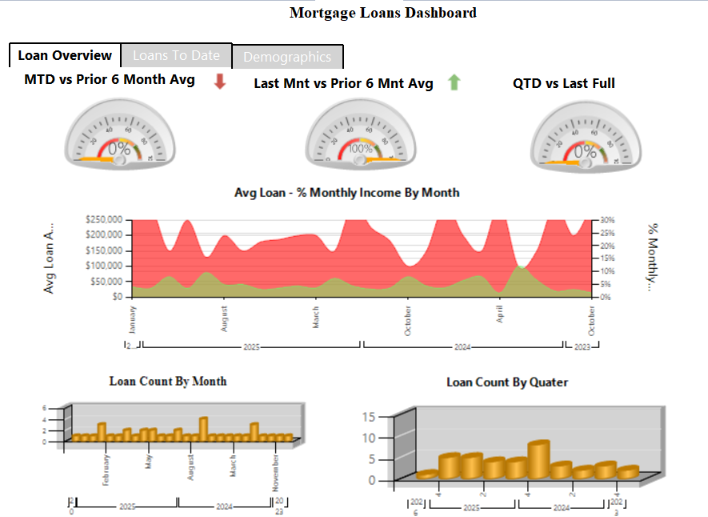
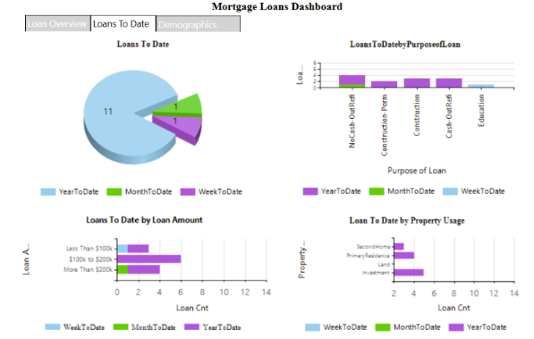
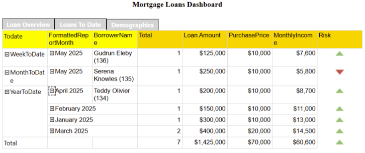

# Mortgage Loan SSRS Dashboard

## Project Overview

This project is an interactive mortgage loan reporting solution developed with SQL Server Reporting Services. This end-to-end mortgage analytics project uses SQL Server, SSIS, SSRS, SSMS, and Visual Studio. I developed SSIS packages to extract data from multiple sources, validate required fields, convert data types, and load clean records into staging and data warehouse tables. Conditional splits and error outputs were used to identify invalid phone numbers, ZIP codes, Social Security numbers, and missing values for further review.

After completing the ETL process, I developed interactive SSRS reports with parameters, gauges, charts, drill-down tables, subreports, conditional formatting, and period comparisons. The solution transforms raw mortgage data into reliable, meaningful insights that support loan-performance monitoring and informed decision-making.

The dashboard allows users to monitor loan activity, compare reporting periods, review borrower and property information, and navigate between overview, loans-to-date, demographics, and detailed reports.

## Business Problem

Mortgage managers need a centralized reporting solution to monitor loan volume, loan value, borrower income, loan purpose, property usage, and performance across different reporting periods.

## Project Objective

The objective was to develop an interactive SSRS dashboard that helps users:

* Monitor mortgage-loan activity
* Compare current results with previous periods
* Analyze loan counts and average loan values
* Review loan purpose and property usage
* Examine borrower and loan-level details
* Identify favorable and unfavorable performance
* Support informed mortgage-management decisions

## Tools Used

* SQL Server Management Studio
* SQL Server
* SQL
* SQL Server Reporting Services
* Microsoft Visual Studio
* Report Builder expressions
* ETL and data-cleaning techniques
* Data warehouse concepts

## Project Workflow

1. Extracted mortgage data from SQL Server.
2. Used SQL to filter, join, clean, and validate the data.
3. Created queries and datasets for the SSRS reports.
4. Connected the report project to the mortgage data source.
5. Created report parameters for interactive filtering.
6. Developed the Loan Overview, Loans to Date, Demographics, and Loan Details pages.
7. Added charts, gauges, tables, drill-down groups, subreports, and conditional formatting.
8. Tested the report navigation, filters, calculations, and totals.

## Report Parameters

Users can filter the reports using parameters such as:

* Report date
* Loan amount
* Loan purpose
* Property usage
* Borrower demographics

## Loan Overview Dashboard

The Loan Overview page provides a high-level view of mortgage activity. It includes month-to-date, previous-month, and quarter-to-date comparisons.

### Main Features

* Month-to-date versus prior six-month average
* Last month versus prior six-month average
* Quarter-to-date versus previous complete period
* Average loan amount by month
* Monthly income percentage
* Loan count by month
* Loan count by quarter
* Positive and negative trend arrows
* Interactive navigation between report pages

## Loans-to-Date Dashboard

The Loans-to-Date page compares loan activity across week-to-date, month-to-date, and year-to-date periods.

### Main Features

* Week-to-date loan activity
* Month-to-date loan activity
* Year-to-date loan activity
* Loans by purpose
* Loans by amount range
* Loans by property usage
* Period-based loan-count comparisons
* Interactive report tabs

## Loan Details Report

The Loan Details page displays borrower and mortgage information in an expandable table.

### Main Features

* Week-to-date, month-to-date, and year-to-date groupings
* Expandable month hierarchy
* Borrower name
* Loan count
* Loan amount
* Purchase price
* Monthly income
* Total calculations
* Risk indicators
* Conditional formatting using green and red arrows

## SSRS Features Demonstrated

* Shared data sources
* Shared datasets
* Report parameters
* Subreports
* Tab-style report navigation
* Drill-down and expandable groups
* Gauges
* Area charts
* Bar charts
* Pie charts
* Matrix and table reports
* Conditional formatting
* SSRS expressions
* Aggregations and calculated values
* Interactive report filtering

## SQL Skills Demonstrated

* Data extraction
* Data cleaning
* Filtering with `WHERE`
* Joining multiple tables
* Data aggregation
* `GROUP BY` calculations
* Date-based analysis
* `CASE` expressions
* Views and reusable queries
* Dataset preparation for SSRS
* Data validation

## Business Value

This reporting solution provides a centralized view of mortgage-loan performance. It allows managers to identify changes in loan activity, compare current results with previous periods, review borrower risk, and make more informed operational decisions.

## Data Privacy

This repository does not contain confidential borrower information, database credentials, or production connection details. Any information displayed is intended only for educational and portfolio purposes.

## Author

**Vestine Nimenya**

Data Analyst | SQL | SSRS | Power BI | Python

* [LinkedIn](https://www.linkedin.com/in/vestine-nimenya-17188b267/)
* [GitHub](https://github.com/2Jay-bi/Mortgage-Loan-SSRS-Dashboard)
